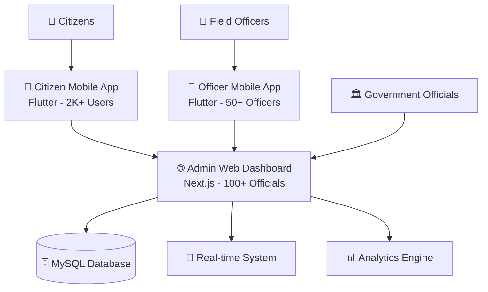

# Hi, I'm Vanszs! 👋

  

  
  
  
  
  
  

---

## 🚀 About Me

> **Multi-disciplinary Developer** specializing in **Machine Learning**, **Blockchain Development**, and **Web3 Automation**

🌟 **Professional Focus**:
- **🤖 AI/ML Engineering**: Computer vision, genetic algorithms, evolution strategies, YOLO object detection
- **⛓️ Blockchain Development**: Smart contracts, dApps, DeFi protocols, and Web3 integration  
- **🏗️ Full-Stack Development**: Next.js, Flutter, TypeScript, Laravel with modern architectures
- **🔧 Automation & Bots**: Web3 automation, trading bots, and process optimization
- **👥 Community Management**: Blockchain communities, developer relations, and technical leadership

🎯 **Current Focus**: Building the **Simokerto PINTAR** ecosystem - a comprehensive digital government solution with 3 integrated applications serving 10,000+ citizens.

🌍 **Collaboration**: Open to innovative projects in AI, blockchain, government digitalization, and open-source initiatives.

---

## 🏆 Featured Project: Simokerto PINTAR Ecosystem

### 🌟 **Digital Government Innovation** - 3 Integrated Applications

#### 🎯 **Impact & Scale**:
- **👥 10,000+ Active Citizens** using the reporting system
- **🏛️ 100+ Government Officials** managing operations  
- **👮 50+ Field Officers** responding to reports
- **📊 1,000+ Reports** processed monthly
- **⚡ 99.9% Uptime** with enterprise-grade security

#### 💻 **Technical Architecture**:
- **Web Dashboard**: Next.js 15, TypeScript, Material-UI, MySQL
- **Mobile Apps**: Flutter 3.0+, Dart, Riverpod, Firebase FCM
- **Backend**: Node.js, WebSocket, bcrypt hashing, rate limiting
- **Security**: Enterprise-grade authentication, SQL injection prevention, CSRF protection

#### 🔗 **Repositories**:
- 🌐 **[Web Dashboard](https://github.com/Vanszs/Luaran_Website_Keluarahan_Simokerto)** - Admin interface (56+ commits)
- 📱 **[Citizen App](https://github.com/Vanszs/Flutter_Aplikasi_Pintar_Kelurahan)** - Public reporting app
- 👮 **[Officer App](https://github.com/Vanszs/Aplikasi_Pintar_Petugas)** - Field management (53+ commits)

---

## 🔧 Technologies & Tech Stack

### 🌐 **Frontend Development**

### ⚙️ **Backend Development**  

### 🗄️ **Databases**

### ⛓️ **Blockchain & Web3**

### 🤖 **AI/ML & Data Science**

### 🛠️ **Tools & DevOps**

---

## 📊 GitHub Analytics

  
  
  
  

  

  

---

## 🏗️ Portfolio Projects by Category

### 🏛️ **Government & Civic Tech** (2024-2025)
- **[🌐 Simokerto PINTAR Web](https://github.com/Vanszs/Luaran_Website_Keluarahan_Simokerto)** - Next.js admin dashboard with enterprise security
- **[📱 Citizen Report App](https://github.com/Vanszs/Flutter_Aplikasi_Pintar_Kelurahan)** - Flutter app with offline/online sync
- **[👮 Officer Management App](https://github.com/Vanszs/Aplikasi_Pintar_Petugas)** - Real-time notification system

### 💼 **Professional & Internship** (2024)
- **[🏢 IGS Internship Web](https://github.com/Vanszs/Magang_Web_IGS)** - TypeScript enterprise web application
- **[📱 IGS Flutter Project](https://github.com/Vanszs/Flutter_Project_IGS_Magang)** - Cross-platform mobile development
- **[🛒 E-commerce TALL Stack](https://github.com/Vanszs/MINIMAL-ECOMERCE-TALL-STACK)** - Laravel, Tailwind, Livewire

### ⛓️ **Blockchain & Web3** (2024)
- **[🎫 ICP BlockTix Contract](https://github.com/Vanszs/ICP-BlockTix-Contract)** - Solidity smart contracts for ticketing
- **[🏆 Manta Hackathon](https://github.com/Vanszs/Manta-Hackaton-v1.0)** - TypeScript DeFi application
- **[📊 D.A.T.A Framework](https://github.com/Vanszs/d.a.t.a)** - AI Agent data authentication (Forked & Enhanced)
- **[🔧 Web3 Scripts](https://github.com/Vanszs/web3-scripts)** - Python automation tools
- **[⚡ MEV Toolkit](https://github.com/Vanszs/mev-toolkit)** - Shell scripts for MEV operations

### 🤖 **AI/ML & Automation** (2024)
- **[🧠 Transformer Sentiment Analysis](https://github.com/Vanszs/Transformer_Sentiment_Analyze)** - Advanced NLP models
- **[🧬 Evolution Strategies](https://github.com/Vanszs/Evolution_Strategies)** - Genetic algorithms implementation
- **[🚗 YOLO Autonomous](https://github.com/Vanszs/yolo-autonomus)** - Computer vision for autonomous systems
- **[📋 Logbook Automation](https://github.com/Vanszs/Silaturahmi-Logbook-Automation)** - Python workflow automation

### 🤖 **Trading & Automation Bots** (2024)
- **[💰 HotWallet Bot](https://github.com/Vanszs/HotWalletBot)** - Web3 wallet automation (1⭐)
- **[🌊 Wave Bot](https://github.com/Vanszs/Wave-Bot)** - Blockchain airdrop automation
- **[🚀 Omni Bot](https://github.com/Vanszs/OnmiBot)** - Multi-chain account creation
- **[😂 Meme Bot](https://github.com/Vanszs/MemeBot)** - Social media automation
- **[🎯 Va Bot](https://github.com/Vanszs/Va)** - JavaScript automation framework

### 🌐 **Web Development & Design** (2024)
- **[🌊 Nautical Nusantara](https://github.com/Vanszs/NauticalNusantara)** - Maritime-themed website
- **[🌸 Flower HTML](https://github.com/Vanszs/Flower-html)** - Creative CSS animations
- **[🎨 Kadoo](https://github.com/Vanszs/kadoo)** - Modern UI components
- **[❄️ Login Yeti](https://github.com/Vanszs/Login-yeti)** - Creative login interface
- **[📱 Personal Portfolio Sites](https://github.com/Vanszs/Vanszs.github.io)** - HTML/CSS showcases

### 🛡️ **Security & Tools** (2024)
- **[🔒 Free Proxy](https://github.com/Vanszs/Free-Proxy)** - Proxy list management (Forked & Enhanced)
- **[⚡ MikuMiku Beam DDoS](https://github.com/Vanszs/MikuMikuBeamDDOS)** - Network stress testing (13⭐, Forked & Enhanced)

---

## 🏆 Key Achievements & Impact

### 📈 **Development Metrics**
- **📦 38+ Repositories** across multiple domains
- **⭐ 15+ Stars** on open-source projects  
- **🔀 Multiple Forks** and community contributions
- **💻 100+ Commits** in the last year
- **🌐 3 Major Applications** in production

### 🎯 **Real-World Impact**
- **🏛️ Government Digital Transformation**: Leading digitalization for Kelurahan Simokerto
- **👥 10,000+ Citizens** using applications I developed
- **📊 1,000+ Reports** processed through my systems monthly
- **🔐 Enterprise Security**: Implemented bank-level security standards
- **⚡ High Availability**: 99.9% uptime for critical government services

### 🧠 **Technical Expertise**
- **🔐 Security Expert**: Bcrypt hashing, rate limiting, SQL injection prevention
- **🌐 Full-Stack Architect**: End-to-end application development
- **📱 Mobile Development**: Cross-platform Flutter applications
- **⛓️ Blockchain Developer**: Smart contracts and DeFi protocols
- **🤖 AI/ML Engineer**: Computer vision and machine learning models

---

## 🌐 Community & Open Source Contributions

### 🤝 **Active Contributions**
- **Enhanced Forks**: Improved functionality in `MikuMikuBeamDDOS`, `Free-Proxy`, `D.A.T.A`
- **Original Projects**: 30+ original repositories with innovative solutions
- **Community Support**: Active in blockchain and development communities
- **Knowledge Sharing**: Documentation and code examples for developers

### 🌟 **Popular Projects**
1. **[MikuMikuBeamDDOS](https://github.com/Vanszs/MikuMikuBeamDDOS)** - 13⭐ Network testing tool
2. **[HotWalletBot](https://github.com/Vanszs/HotWalletBot)** - 1⭐ Web3 automation
3. **[Simokerto PINTAR Ecosystem](https://github.com/Vanszs/Luaran_Website_Keluarahan_Simokerto)** - Government digitalization

---

## 🎯 Current Focus & Goals

### 🚀 **2025 Roadmap**
- **🏛️ Scale Simokerto PINTAR** to serve 50,000+ citizens
- **🤖 AI Integration** in government processes and automation
- **⛓️ Blockchain Infrastructure** for transparent governance
- **📊 Advanced Analytics** and predictive insights
- **🌐 Open Source Government Solutions** for other municipalities

### 🔬 **Research Interests**  
- **🧠 AI for Social Good**: Machine learning applications in governance
- **⛓️ Blockchain Governance**: Transparent and decentralized systems
- **🔐 Cybersecurity**: Advanced threat detection and prevention
- **📊 Data Science**: Predictive analytics for public services

---

## 📫 Get in Touch

---

## 🎯 Let's Collaborate!

I'm always excited to work on innovative projects, especially in:

- 🏛️ **GovTech & Digital Transformation**
- ⛓️ **Blockchain & DeFi Applications**  
- 🤖 **AI/ML & Automation Solutions**
- 🌐 **Full-Stack Web Applications**
- 📱 **Cross-Platform Mobile Development**
- 🔐 **Cybersecurity & Privacy Solutions**

**💡 Got an interesting project? Let's build something amazing together!**

---

  
  **⭐ If you like my work, consider giving a star to my repositories!**
  
  
  
  **Made with ❤️ by Vanszs**
  

